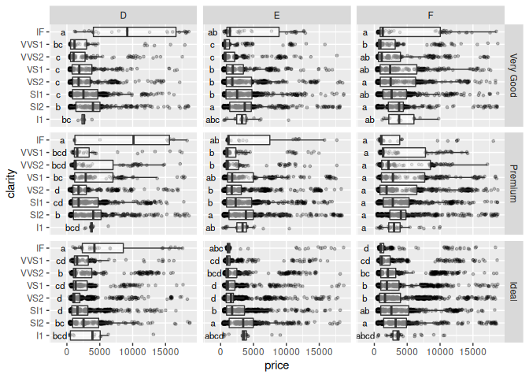

<!-- README.md is generated from README.Rmd. Please edit that file -->

# tukeygrps

<!-- badges: start -->

[](https://www.tidyverse.org/lifecycle/#experimental)
[](https://cran.r-project.org/package=tukeygrps)
<!-- badges: end -->

Tukeygrps provides a simple helper function for the letter annotation of
(gg)plots according to statistical differences between groups determined
by a Tukey-HSD test.

## Installation

You can install tukeygrps from github using devtools:

``` r
install.packages("devtools")
install_github("leonardblaschek/tukeygrps")
```

## Examples

Here we use tukey\_groups() to quickly add letters to a geom\_point
plot. Alpha is set to 0.001, the letters are printed at y = 0, and there
are no additional grouping variables.

``` r
library(tukeygrps)
library(tidyverse)
#> Registered S3 methods overwritten by 'ggplot2':
#>   method         from 
#>   [.quosures     rlang
#>   c.quosures     rlang
#>   print.quosures rlang
#> ── Attaching packages ─────────────────────────────────────────────────────────────────────────────────────────────────────────────────────────────────────────────────────────────────────────────────── tidyverse 1.2.1 ──
#> ✔ ggplot2 3.1.1     ✔ purrr   0.3.2
#> ✔ tibble  2.1.1     ✔ dplyr   0.8.1
#> ✔ tidyr   0.8.3     ✔ stringr 1.4.0
#> ✔ readr   1.3.1     ✔ forcats 0.4.0
#> ── Conflicts ────────────────────────────────────────────────────────────────────────────────────────────────────────────────────────────────────────────────────────────────────────────────────── tidyverse_conflicts() ──
#> ✖ dplyr::filter() masks stats::filter()
#> ✖ dplyr::lag()    masks stats::lag()
data(mpg)
head(mpg)
#> # A tibble: 6 x 11
#>   manufacturer model displ  year   cyl trans  drv     cty   hwy fl    class
#>   <chr>        <chr> <dbl> <int> <int> <chr>  <chr> <int> <int> <chr> <chr>
#> 1 audi         a4      1.8  1999     4 auto(… f        18    29 p     comp…
#> 2 audi         a4      1.8  1999     4 manua… f        21    29 p     comp…
#> 3 audi         a4      2    2008     4 manua… f        20    31 p     comp…
#> 4 audi         a4      2    2008     4 auto(… f        21    30 p     comp…
#> 5 audi         a4      2.8  1999     6 auto(… f        16    26 p     comp…
#> 6 audi         a4      2.8  1999     6 manua… f        18    26 p     comp…

tukey_letters <- tukey_groups(mpg, hwy, class, 0, 0.001)

head(tukey_letters)
#>            hwy groups      class
#> compact      0      a    compact
#> subcompact   0      a subcompact
#> midsize      0      a    midsize
#> 2seater      0     ab    2seater
#> minivan      0     bc    minivan
#> suv          0     cd        suv

ggplot() +
  geom_point(data = mpg, 
             aes(x = class,
                 y = hwy)) +
  geom_text(data = tukey_letters,
            aes(x = class,
                y = hwy,
                label = groups)) +
  coord_flip()
```


Here we split the statistical analysis by two grouping variables (“cut”
and “color”), set the alpha to 0.05 and print the letters at y = -1000.

``` r
library(tukeygrps)
library(tidyverse)

data(diamonds)
diamonds <- diamonds %>% 
  filter(cut %in% c("Ideal", "Premium", "Very Good") & color %in% c("D", "E", "F"))
head(diamonds)
#> # A tibble: 6 x 10
#>   carat cut       color clarity depth table price     x     y     z
#>   <dbl> <ord>     <ord> <ord>   <dbl> <dbl> <int> <dbl> <dbl> <dbl>
#> 1  0.23 Ideal     E     SI2      61.5    55   326  3.95  3.98  2.43
#> 2  0.21 Premium   E     SI1      59.8    61   326  3.89  3.84  2.31
#> 3  0.22 Premium   F     SI1      60.4    61   342  3.88  3.84  2.33
#> 4  0.2  Premium   E     SI2      60.2    62   345  3.79  3.75  2.27
#> 5  0.32 Premium   E     I1       60.9    58   345  4.38  4.42  2.68
#> 6  0.23 Very Good E     VS2      63.8    55   352  3.85  3.92  2.48

tukey_letters <- tukey_groups(diamonds, price, clarity, -1000, 0.05, cut, color)

head(tukey_letters)
#> # A tibble: 6 x 5
#> # Groups:   cut, color [1]
#>   cut       color price groups clarity
#>   <ord>     <ord> <dbl> <chr>  <chr>  
#> 1 Very Good D     -1000 a      IF     
#> 2 Very Good D     -1000 b      SI2    
#> 3 Very Good D     -1000 c      SI1    
#> 4 Very Good D     -1000 c      VS2    
#> 5 Very Good D     -1000 c      VVS1   
#> 6 Very Good D     -1000 c      VS1

ggplot() +
  geom_boxplot(data = diamonds, 
             aes(x = clarity,
                 y = price)) +
  geom_text(data = tukey_letters,
            aes(x = clarity,
                y = price,
                label = groups)) +
  facet_grid(cut ~ color) +
  coord_flip()
```



*Note:* The distributions and sample numbers in these example datasets
don’t always allow for the use of a parametric test such as the
Tukey-HSD. Before you use this function, make sure that your
observations are:

  - **normally** distributed
  - **homoscedastic**
  - **independent** within and between groups
  - ideally of similar sample sizes
